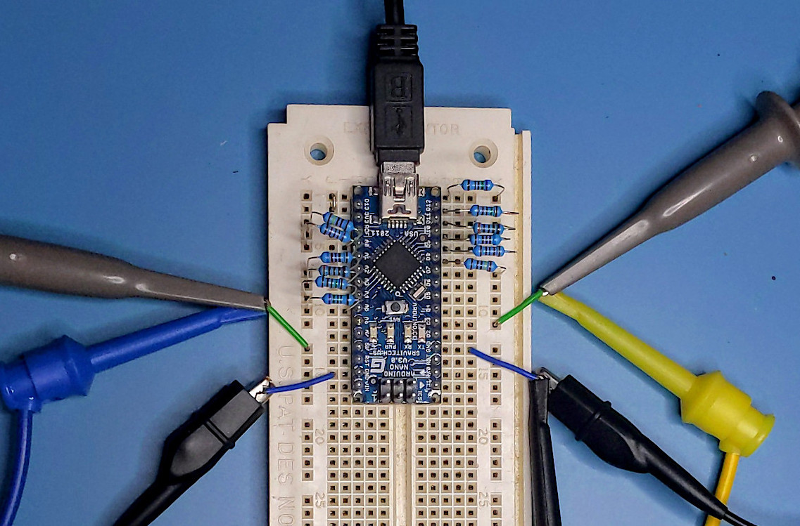

# Arduino Binary-Weighted DAC

- 2 channels of fast 6-bit analog output with an Arduino Nano and 12 resistors
- Display 64x64 pixel bitmaps and vector animations on an oscilloscope


A binary-weighted [DAC](https://en.wikipedia.org/wiki/Digital-to-analog_converter) is a simple method for transforming multiple digital outputs into a single analog output using only resistors. The resistors are chosen from a power-of-two sequence, with the largest resistor tied to the least-significant bit and the smallest resistor tied to the most-significant bit.


Unfortunately, powers-of-two do not map well to the standard [E series](https://en.wikipedia.org/wiki/E_series_of_preferred_numbers) (roughly based on powers-of-ten), which makes it difficult to select more than a few suitable resistors. For this reason, it's more common to build larger DACs with R-2R [resistor ladders](https://en.wikipedia.org/wiki/Resistor_ladder) which use twice as many resistors, but only consisting of two values (R and 2R).

However, for a simple 6-bit binary-weighted DAC, the resistors can mostly be sourced from the E24 series, often found in cheap resistor kits. There isn't an exact match for 6.0 kΩ; the closest are 6.2 kΩ in E24 or 6.04 kΩ in E96, but two 3.0 kΩ in series or two 12 kΩ in parallel can be substituted if better accuracy is needed.

```
E24   Value
7.5 - 750 Ω
1.5 - 1.5 kΩ
3.0 - 3.0 kΩ
6.2 - 6.2 kΩ (should be 6.0 kΩ)
1.2 - 12 kΩ
2.4 - 24 kΩ
```

## Arduino low-level port I/O

For digital output from the Arduino, it's important to use the GPIO ports directly instead of `digitalWrite()`. Every pin of a given port can be written simultaneously in a single CPU cycle by an `OUT` instruction. Comparatively, `digitalWrite()` calls take around 50 CPU cycles just to set a single pin. Not only would the latter be much slower (300x slower for 6 bits), but because the updates to each pin would be staggered, the resulting analog signal would appear to glitch whenever bits overflow.

The ATmega328p used in the Arduino Nano has 3 such GPIO ports named B, C, and D. Conveniently, the low 6-bits of ports B and C each map to 6 digital pins (Arduino pins 8-13 and 14-19) that can be wired to the DACs. This way, raw values 0 through 63 can be written directly to the port, corresponding to analog values 0 through 5 volts.




## Displaying graphics on an oscilloscope

[Analog video](https://en.wikipedia.org/wiki/Analog_television) displays like CRT TVs scan a dot across the screen in a fixed [raster](https://en.wikipedia.org/wiki/Raster_scan) pattern. To create a picture, an analog signal varies the intensity of the dot at precise times during the raster.

With a [vector display](https://en.wikipedia.org/wiki/Vector_monitor) like an oscilloscope in X-Y mode, precise timing isn't required as the position of the dot is under full control and can simply be moved to wherever the display should be lit.

A bitmap image can be drawn following the same raster order as analog video, but jumping from pixel to pixel and skipping those that shouldn't be lit. This way, the intensity of the dot doesn't need to vary at all; the brightness of individual pixels can be adjusted by varying how long the dot is held in place before moving to the next pixel. 

Vector graphics like lines and curves are even simpler (and faster) as the X-Y position of the dot can directly trace the desired shape. When the X-Y position is controlled digitally, a fast line drawing algorithm like [Bresenham's](https://en.wikipedia.org/wiki/Bresenham's_line_algorithm) is useful.

TODO oscope wiring diagram, picture, or instructions?

## Building the demo

Use the [PlatformIO](https://platformio.org/) plugin for [VSCode](https://code.visualstudio.com/).

Open the project folder with VSCode, select the environment for your board (`uno`, `nano`, `oldnano`), and click `Upload`.


The [core](https://github.com/trevor-makes/core) library is required and PlatformIO will download this into the `.pio` folder.

Distributed under the [MIT license](LICENSE.txt)

## Using the demo

After building and uploading the program to the Arduino, connect a serial monitor such as the one included with PlatformIO. A '>' should appear as a prompt for input. The following commands are available:

```
>attract
```
Cycle between several different display modes with preset time intervals between each.

```
>logo
```
Display "Trevor Makes!" logo in bitmap mode.

```
>clear
```
Clears the bitmap display.

```
>print "text"
```
Scroll bitmap up one line and print given text.

```
>maze
```
Display scrolling randomized maze using PETSCII characters.

```
>circle
```
Display vector circle (cosine in X and sine in Y).

```
>cross
```
Display vector cross (triangle wave in X and sawtooth wave in Y).

```
>bounce
```
Display bouncing ball vector animation.

```
>circum
```
Display random circumscribed triangles animation.

```
>doge
```
Display doge bitmap.


```
>pepe
```
Display pepe bitmap.


```
>fliph
```
Flip bitmap display horizontally.

```
>flipv
```
Flip bitmap display vertically.

```
>export
```
Capture current bitmap display in [IHX](https://en.wikipedia.org/wiki/Intel_HEX) format and print to terminal.

```
>import
```
Read [IHX](https://en.wikipedia.org/wiki/Intel_HEX) formatted string from terminal and unpack into bitmap display. Copy-paste IHX from `>export` command or [convert.py](bitmaps/convert.py) script.

```
>save [index]
```
Store current bitmap in EEPROM. Arduino Uno/Nano can hold 2 64x64 bitmaps in EEPROM, at indices 0 and 1 (defaults to 0 if not given).

```
>load
```
Load bitmap display from EEPROM. Arduino Uno/Nano can hold 2 64x64 bitmaps in EEPROM, at indices 0 and 1 (defaults to 0 if not given).

```
>delay [microseconds]
```
Number of microseconds to linger on each set pixel in bitmap mode. Larger numbers make the display sharper, but at reduced frame rate.
